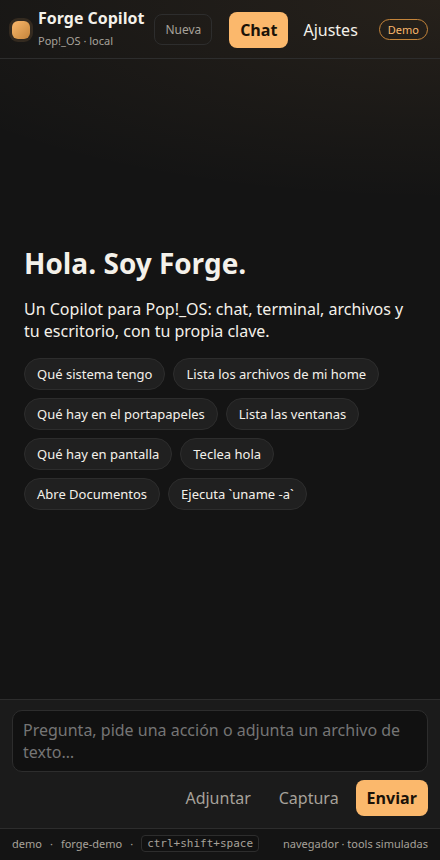
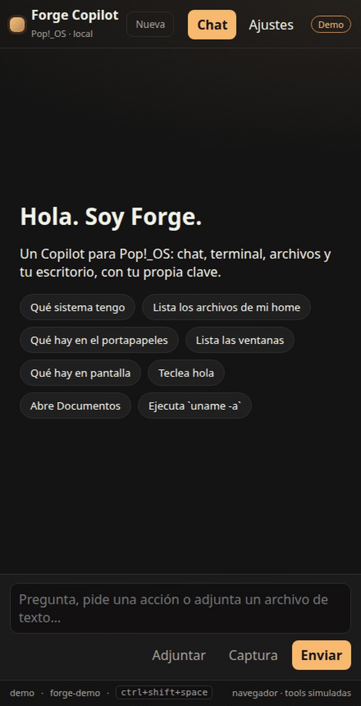
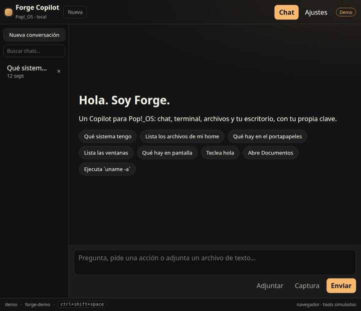
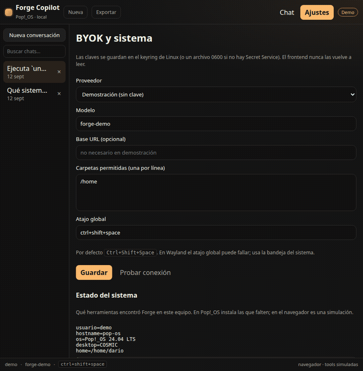
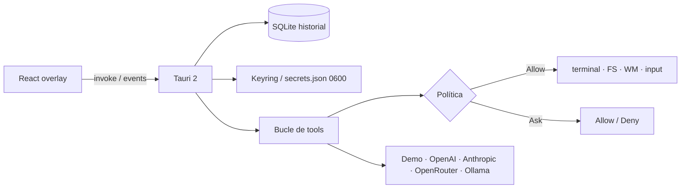

# Forge Copilot

**Copilot local para Pop!_OS** (y otros Linux): overlay tipo Windows Copilot, chat en streaming, **BYOK** y acceso real a tu máquina. Corre en el escritorio. No es un servicio en la nube y no controla otros equipos.

[](https://github.com/DarioDGR12/Forge-copilot/actions/workflows/ci.yml)
[](LICENSE)

<p align="center">
  
</p>

## Demo

Chat en el panel de 440px (el tamaño de la app Tauri):



Las acciones peligrosas piden Allow / Deny:



Ajustes BYOK y **estado del sistema** (qué herramientas hay instaladas):



```bash
npm run tauri dev          # app real en Pop!_OS
npm run dev                # demo en el navegador (tools simuladas)
```

## Qué hace

| Área | Qué puedes pedirle |
| --- | --- |
| Sistema | Distro, usuario, escritorio, procesos, apps `.desktop` |
| Archivos | Listar, leer, escribir, abrir con `xdg-open`, adjuntar texto |
| Terminal | `run_terminal` (siempre confirma) |
| Escritorio | Portapapeles, ventanas (`wmctrl`), notificaciones, captura |
| Visión | La captura se guarda y se envía a OpenAI / Anthropic / OpenRouter |
| Computer Use lite | Teclear, atajos (`ctrl+c`) y clic — lista blanca, siempre confirma |

Forge **se oculta** antes de teclear o hacer clic para no robar el foco. Si falta `xdotool` / `ydotool`, lo dice: no finge el clic.

## Instalar en Pop!_OS

### Desde el código

Necesitas Node 20+ y Rust **1.88** (`rust-toolchain.toml`).

```bash
sudo apt install libwebkit2gtk-4.1-dev libappindicator3-dev librsvg2-dev patchelf \
  libgtk-3-dev libayatana-appindicator3-dev

git clone https://github.com/DarioDGR12/Forge-copilot.git
cd Forge-copilot
npm install
npm run tauri dev
```

### Paquete `.deb`

```bash
npm run tauri build
sudo apt install ./src-tauri/target/release/bundle/deb/forge-copilot_0.1.0_*.deb
```

También se genera AppImage si el entorno de build lo permite.

### Herramientas de escritorio (opcionales)

Sin estas, el chat funciona; las tools fallan con un error claro.

```bash
sudo apt install grim wl-clipboard xclip libnotify-bin wmctrl xdotool
```

En COSMIC / Wayland, para teclado y ratón de verdad: `ydotool` + daemon `ydotoold` (usuario en el grupo `input`). `wmctrl` y `xdotool` a menudo no ven el compositor.

En **Ajustes → Estado del sistema** ves qué encontró Forge en *esta* máquina.

## Uso

1. Ábrelo (o el icono de bandeja). Cerrar la ventana **oculta**, no mata el proceso.
2. **Ajustes**: proveedor + API key (si no es demo/Ollama) → **Guardar clave**.
3. Habla en el chat o pulsa un chip. Si pide terminal, escribir, teclear o clic: confirma.
4. Atajo global: `Ctrl+Shift+Space`. En COSMIC/GNOME, Super está reservado.

### Atajos de la UI

| Atajo | Acción |
| --- | --- |
| `Ctrl+Shift+Space` | Mostrar / ocultar (global) |
| `Escape` | Ocultar el overlay |
| `Ctrl+N` | Nueva conversación |
| `Ctrl+,` | Ajustes |
| `Ctrl+E` | Exportar el chat a Markdown |

### Wayland

El atajo global y el anclaje al borde derecho pueden fallar según el compositor. Usa la bandeja. La captura prueba `grim`, `gnome-screenshot`, `spectacle` o `import`.

### Flatpak

Fuera de v1: el sandbox pelea con un agente que necesita terminal y disco reales.

## Política de aprobación

**Automático** (dentro de `$HOME` o de solo lectura): `host_info`, `list_dir`, `read_file`, `list_apps`, `list_processes`, `screenshot`, `clipboard_read`, `list_windows`, `notify`, `pointer_info`, `open_path`.

**Siempre confirma**: `run_terminal`, `write_file`, `launch_app`, `clipboard_write`, `focus_window`.

**Confirma y marca sensible**: `type_text`, `press_keys`, `mouse_click`, rutas tipo `~/.ssh`, `sudo`, `rm -rf`.

## Arquitectura



- UI: React + Vite, español, acento Pop `#fbb86c`
- Núcleo: Rust / Tauri 2, identifier `com.forge.copilot`
- Historial: `~/.local/share/forge-copilot/forge.db`
- Claves: Secret Service; si no hay llavero, `~/.local/share/forge-copilot/secrets.json` modo `0600`
- El frontend **nunca** vuelve a leer la API key

## Desarrollo

```bash
npm install
npm test                 # cargo test (política, parsers, visión, diagnóstico)
npm run dev              # http://localhost:1420 demo
npm run tauri dev        # overlay real
```

CI (`.github/workflows/ci.yml`): `npm ci`, `npm run build`, `cargo test` en Ubuntu 24.04 con Rust 1.88.

## Privacidad

- No hay backend de Forge. Nada se “sube” a nosotros.
- El modelo que *tú* eliges (OpenAI, Anthropic, etc.) recibe el texto del chat, resultados de tools y, si hay, las últimas capturas.
- Exportar (`Ctrl+E`) genera un `.md` local.

## Licencia

[Unlicense](LICENSE) (dominio público).
